# ReqAI – High-Level Design (HLD)

**Version:** 1.0.0  
**Status:** Approved  
**Author:** Enterprise Architecture  
**Last Updated:** 2025  
**Classification:** Internal – Confidential

---

## Table of Contents

1. [Application Architecture Overview](#1-application-architecture-overview)
2. [Frontend Architecture](#2-frontend-architecture)
3. [Backend Architecture](#3-backend-architecture)
4. [Folder Structure](#4-folder-structure)
5. [Database Design](#5-database-design)
6. [Authentication & Authorization Flow](#6-authentication--authorization-flow)
7. [API Flow](#7-api-flow)
8. [Sequence Diagrams](#8-sequence-diagrams)
9. [Deployment Diagram](#9-deployment-diagram)
10. [Technology Selection](#10-technology-selection)

---

## 1. Application Architecture Overview

ReqAI follows a **layered, clean architecture** with a strict separation between the presentation, application, domain, and infrastructure layers. The system is designed as a **monorepo** containing a React SPA frontend, an Express/Node.js backend, and shared TypeScript types.

### 1.1 System Context Diagram

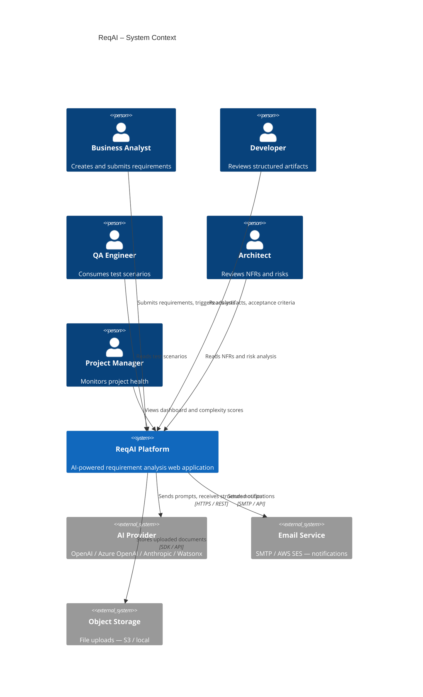

---

### 1.2 High-Level Architecture Diagram

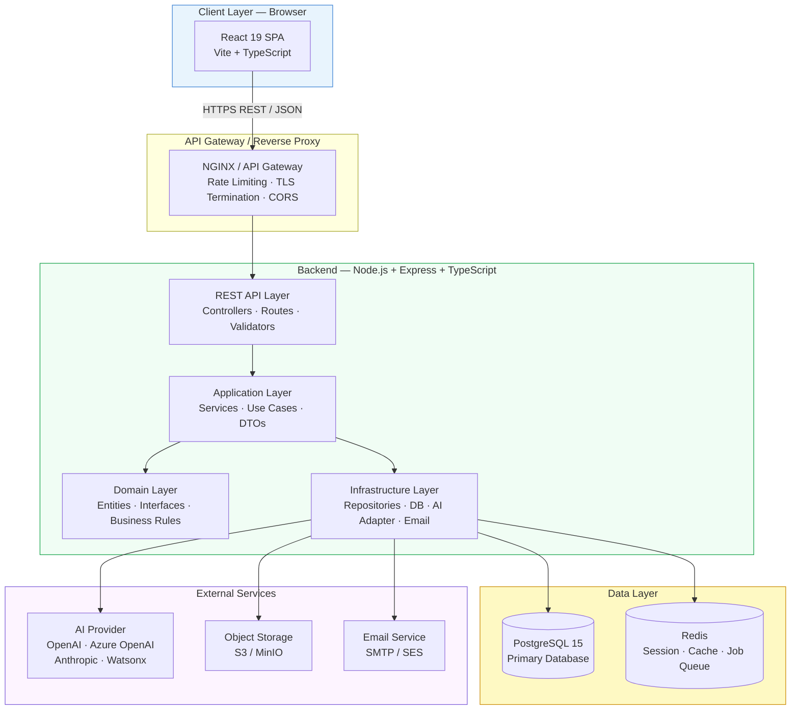

---

## 2. Frontend Architecture

### 2.1 Frontend Layered Architecture

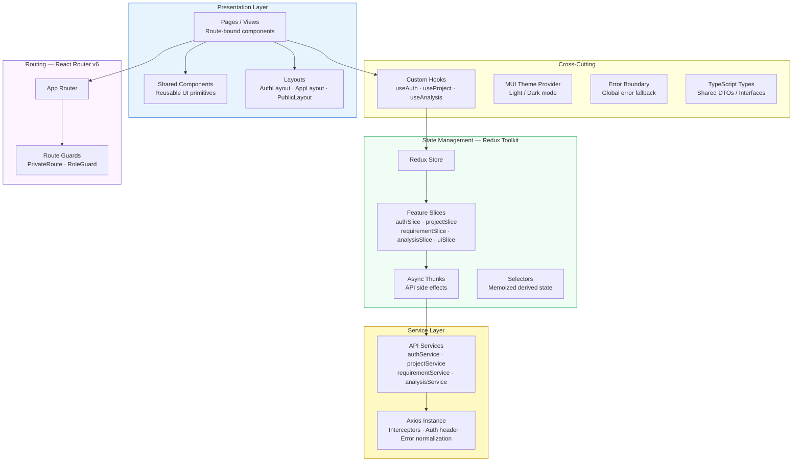

### 2.2 Frontend Page Map

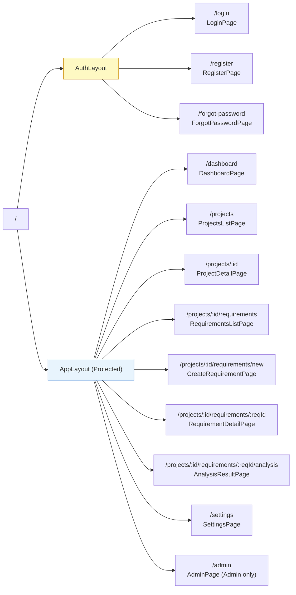

---

## 3. Backend Architecture

### 3.1 Clean Architecture Layers

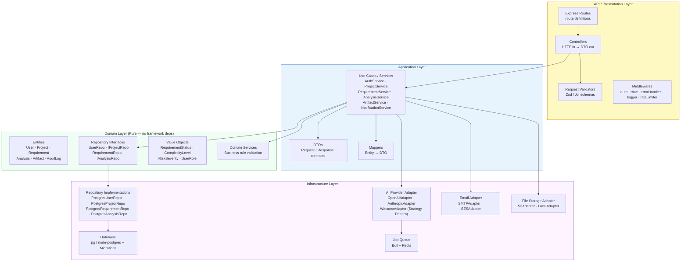

### 3.2 AI Analysis Pipeline

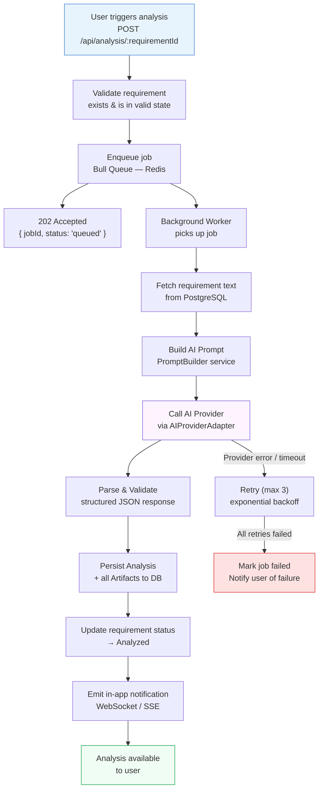

---

## 4. Folder Structure

### 4.1 Monorepo Root

```
reqai/
├── frontend/                   # React 19 + Vite SPA
├── backend/                    # Node.js + Express API
├── shared/                     # Shared TypeScript types (DTOs, enums)
├── docs/                       # Architecture docs, PRD, HLD
├── .env.example                # Root env template
├── docker-compose.yml          # Local dev orchestration
├── docker-compose.prod.yml     # Production orchestration
└── package.json                # Monorepo workspace root
```

### 4.2 Frontend Folder Structure

```
frontend/
├── public/
│   └── favicon.ico
├── src/
│   ├── app/
│   │   ├── store.ts                    # Redux store configuration
│   │   ├── rootReducer.ts              # Combined reducers
│   │   └── router.tsx                  # React Router configuration
│   │
│   ├── features/                       # Feature-based slices
│   │   ├── auth/
│   │   │   ├── authSlice.ts
│   │   │   ├── authThunks.ts
│   │   │   ├── authSelectors.ts
│   │   │   └── types.ts
│   │   ├── projects/
│   │   │   ├── projectSlice.ts
│   │   │   ├── projectThunks.ts
│   │   │   ├── projectSelectors.ts
│   │   │   └── types.ts
│   │   ├── requirements/
│   │   │   ├── requirementSlice.ts
│   │   │   ├── requirementThunks.ts
│   │   │   ├── requirementSelectors.ts
│   │   │   └── types.ts
│   │   ├── analysis/
│   │   │   ├── analysisSlice.ts
│   │   │   ├── analysisThunks.ts
│   │   │   ├── analysisSelectors.ts
│   │   │   └── types.ts
│   │   └── ui/
│   │       ├── uiSlice.ts              # Notifications, modals, loading
│   │       └── types.ts
│   │
│   ├── pages/                          # Route-bound page components
│   │   ├── auth/
│   │   │   ├── LoginPage.tsx
│   │   │   ├── RegisterPage.tsx
│   │   │   └── ForgotPasswordPage.tsx
│   │   ├── dashboard/
│   │   │   └── DashboardPage.tsx
│   │   ├── projects/
│   │   │   ├── ProjectsListPage.tsx
│   │   │   ├── ProjectDetailPage.tsx
│   │   │   └── CreateProjectPage.tsx
│   │   ├── requirements/
│   │   │   ├── RequirementsListPage.tsx
│   │   │   ├── RequirementDetailPage.tsx
│   │   │   └── CreateRequirementPage.tsx
│   │   ├── analysis/
│   │   │   └── AnalysisResultPage.tsx
│   │   ├── admin/
│   │   │   └── AdminPage.tsx
│   │   └── settings/
│   │       └── SettingsPage.tsx
│   │
│   ├── components/                     # Shared reusable components
│   │   ├── common/
│   │   │   ├── AppButton.tsx
│   │   │   ├── AppCard.tsx
│   │   │   ├── AppChip.tsx
│   │   │   ├── AppDialog.tsx
│   │   │   ├── AppTable.tsx
│   │   │   ├── AppTextField.tsx
│   │   │   ├── ConfirmDialog.tsx
│   │   │   ├── EmptyState.tsx
│   │   │   ├── ErrorBoundary.tsx
│   │   │   ├── LoadingSpinner.tsx
│   │   │   ├── PageHeader.tsx
│   │   │   └── StatusChip.tsx
│   │   ├── layout/
│   │   │   ├── AppLayout.tsx
│   │   │   ├── AuthLayout.tsx
│   │   │   ├── Sidebar.tsx
│   │   │   ├── TopBar.tsx
│   │   │   └── NotificationBell.tsx
│   │   ├── analysis/
│   │   │   ├── AnalysisTabs.tsx
│   │   │   ├── UserStoriesPanel.tsx
│   │   │   ├── AcceptanceCriteriaPanel.tsx
│   │   │   ├── TestScenariosPanel.tsx
│   │   │   ├── NFRPanel.tsx
│   │   │   ├── RisksPanel.tsx
│   │   │   ├── TechnicalNotesPanel.tsx
│   │   │   ├── ComplexityScoreCard.tsx
│   │   │   ├── MissingInfoPanel.tsx
│   │   │   └── ExportMenu.tsx
│   │   └── requirements/
│   │       ├── RequirementCard.tsx
│   │       ├── RequirementForm.tsx
│   │       ├── RequirementStatusBadge.tsx
│   │       └── FileUploadZone.tsx
│   │
│   ├── hooks/                          # Custom React hooks
│   │   ├── useAuth.ts
│   │   ├── useProject.ts
│   │   ├── useRequirement.ts
│   │   ├── useAnalysis.ts
│   │   ├── useNotifications.ts
│   │   ├── useDebounce.ts
│   │   └── useLocalStorage.ts
│   │
│   ├── services/                       # Axios-based API services
│   │   ├── axios.instance.ts           # Base Axios config + interceptors
│   │   ├── auth.service.ts
│   │   ├── project.service.ts
│   │   ├── requirement.service.ts
│   │   ├── analysis.service.ts
│   │   └── notification.service.ts
│   │
│   ├── types/                          # TypeScript interfaces
│   │   ├── auth.types.ts
│   │   ├── project.types.ts
│   │   ├── requirement.types.ts
│   │   ├── analysis.types.ts
│   │   └── api.types.ts                # ApiResponse<T>, PaginatedResponse<T>
│   │
│   ├── theme/
│   │   ├── theme.ts                    # MUI theme configuration
│   │   ├── palette.ts
│   │   └── typography.ts
│   │
│   ├── utils/
│   │   ├── constants.ts
│   │   ├── formatters.ts
│   │   ├── validators.ts
│   │   └── exportUtils.ts
│   │
│   ├── App.tsx
│   ├── main.tsx
│   └── vite-env.d.ts
│
├── .env.local
├── .eslintrc.cjs
├── .prettierrc
├── tsconfig.json
├── vite.config.ts
└── package.json
```

### 4.3 Backend Folder Structure

```
backend/
├── src/
│   ├── api/                            # Presentation Layer
│   │   ├── routes/
│   │   │   ├── index.ts                # Route aggregator
│   │   │   ├── auth.routes.ts
│   │   │   ├── project.routes.ts
│   │   │   ├── requirement.routes.ts
│   │   │   ├── analysis.routes.ts
│   │   │   └── admin.routes.ts
│   │   ├── controllers/
│   │   │   ├── auth.controller.ts
│   │   │   ├── project.controller.ts
│   │   │   ├── requirement.controller.ts
│   │   │   ├── analysis.controller.ts
│   │   │   └── admin.controller.ts
│   │   ├── validators/
│   │   │   ├── auth.validator.ts
│   │   │   ├── project.validator.ts
│   │   │   ├── requirement.validator.ts
│   │   │   └── analysis.validator.ts
│   │   └── middlewares/
│   │       ├── authenticate.middleware.ts
│   │       ├── authorize.middleware.ts
│   │       ├── errorHandler.middleware.ts
│   │       ├── requestLogger.middleware.ts
│   │       ├── rateLimiter.middleware.ts
│   │       └── validate.middleware.ts
│   │
│   ├── application/                    # Application Layer
│   │   ├── services/
│   │   │   ├── auth.service.ts
│   │   │   ├── project.service.ts
│   │   │   ├── requirement.service.ts
│   │   │   ├── analysis.service.ts
│   │   │   ├── artifact.service.ts
│   │   │   └── notification.service.ts
│   │   ├── dtos/
│   │   │   ├── auth.dto.ts
│   │   │   ├── project.dto.ts
│   │   │   ├── requirement.dto.ts
│   │   │   └── analysis.dto.ts
│   │   └── mappers/
│   │       ├── project.mapper.ts
│   │       ├── requirement.mapper.ts
│   │       └── analysis.mapper.ts
│   │
│   ├── domain/                         # Domain Layer (framework-free)
│   │   ├── entities/
│   │   │   ├── User.entity.ts
│   │   │   ├── Project.entity.ts
│   │   │   ├── Requirement.entity.ts
│   │   │   ├── Analysis.entity.ts
│   │   │   ├── Artifact.entity.ts
│   │   │   └── AuditLog.entity.ts
│   │   ├── interfaces/
│   │   │   ├── repositories/
│   │   │   │   ├── IUserRepository.ts
│   │   │   │   ├── IProjectRepository.ts
│   │   │   │   ├── IRequirementRepository.ts
│   │   │   │   └── IAnalysisRepository.ts
│   │   │   └── services/
│   │   │       ├── IAIProvider.ts
│   │   │       ├── IEmailProvider.ts
│   │   │       └── IFileStorageProvider.ts
│   │   ├── value-objects/
│   │   │   ├── RequirementStatus.ts
│   │   │   ├── ComplexityLevel.ts
│   │   │   ├── RiskSeverity.ts
│   │   │   └── UserRole.ts
│   │   └── errors/
│   │       ├── AppError.ts
│   │       ├── NotFoundError.ts
│   │       ├── UnauthorizedError.ts
│   │       ├── ForbiddenError.ts
│   │       └── ValidationError.ts
│   │
│   ├── infrastructure/                 # Infrastructure Layer
│   │   ├── database/
│   │   │   ├── connection.ts           # pg Pool setup
│   │   │   ├── migrations/
│   │   │   │   ├── 001_create_users.sql
│   │   │   │   ├── 002_create_projects.sql
│   │   │   │   ├── 003_create_requirements.sql
│   │   │   │   ├── 004_create_analyses.sql
│   │   │   │   ├── 005_create_artifacts.sql
│   │   │   │   └── 006_create_audit_logs.sql
│   │   │   └── seeds/
│   │   │       └── seed.ts
│   │   ├── repositories/
│   │   │   ├── user.repository.ts
│   │   │   ├── project.repository.ts
│   │   │   ├── requirement.repository.ts
│   │   │   └── analysis.repository.ts
│   │   ├── ai/
│   │   │   ├── AIProviderFactory.ts    # Factory — selects provider
│   │   │   ├── OpenAIAdapter.ts
│   │   │   ├── AnthropicAdapter.ts
│   │   │   ├── AzureOpenAIAdapter.ts
│   │   │   └── WatsonxAdapter.ts
│   │   ├── queue/
│   │   │   ├── queue.ts                # Bull queue setup
│   │   │   └── analysis.worker.ts      # Worker process
│   │   ├── email/
│   │   │   ├── SMTPAdapter.ts
│   │   │   └── SESAdapter.ts
│   │   └── storage/
│   │       ├── S3Adapter.ts
│   │       └── LocalStorageAdapter.ts
│   │
│   ├── config/
│   │   ├── env.ts                      # Typed env validation (zod)
│   │   ├── database.config.ts
│   │   ├── redis.config.ts
│   │   └── ai.config.ts
│   │
│   ├── shared/
│   │   ├── logger.ts                   # Winston structured logger
│   │   ├── constants.ts
│   │   └── utils.ts
│   │
│   ├── app.ts                          # Express app setup
│   └── server.ts                       # HTTP server entry point
│
├── .env
├── .env.example
├── .eslintrc.cjs
├── .prettierrc
├── tsconfig.json
└── package.json
```

### 4.4 Shared Package Structure

```
shared/
├── src/
│   ├── types/
│   │   ├── auth.types.ts
│   │   ├── project.types.ts
│   │   ├── requirement.types.ts
│   │   └── analysis.types.ts
│   ├── enums/
│   │   ├── UserRole.enum.ts
│   │   ├── RequirementStatus.enum.ts
│   │   ├── ComplexityLevel.enum.ts
│   │   └── RiskSeverity.enum.ts
│   └── index.ts
├── tsconfig.json
└── package.json
```

---

## 5. Database Design

### 5.1 Entity Relationship Diagram

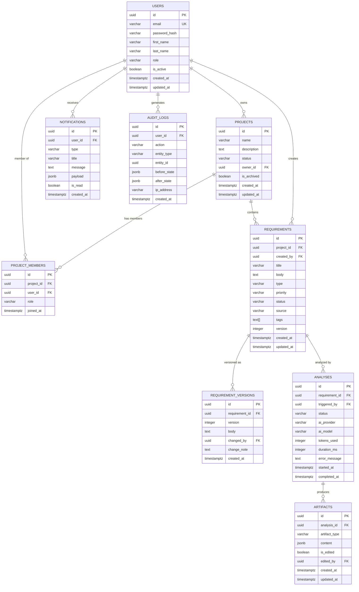

### 5.2 Artifact Content JSON Schema

The `artifacts.content` JSONB column stores structured AI output per artifact type:

```
Artifact Types:
├── USER_STORIES         → { stories: [{ id, role, goal, benefit, priority }] }
├── ACCEPTANCE_CRITERIA  → { criteria: [{ storyId, given, when, then }] }
├── TEST_SCENARIOS       → { scenarios: [{ id, title, type, steps, expected }] }
├── NON_FUNCTIONAL_REQS  → { nfrs: [{ category, description, priority }] }
├── RISKS                → { risks: [{ id, title, description, severity, mitigation }] }
├── TECHNICAL_NOTES      → { notes: string, dependencies: [], considerations: [] }
├── COMPLEXITY_SCORE     → { level, score, reasoning, breakdown: {} }
├── SUMMARY              → { executive: string, keyPoints: [] }
└── MISSING_INFO         → { items: [{ area, question, impact }] }
```

---

## 6. Authentication & Authorization Flow

### 6.1 Authentication Flow

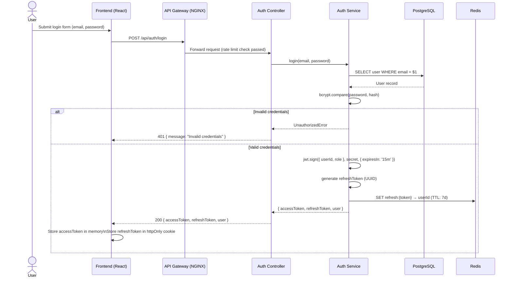

### 6.2 Token Refresh Flow

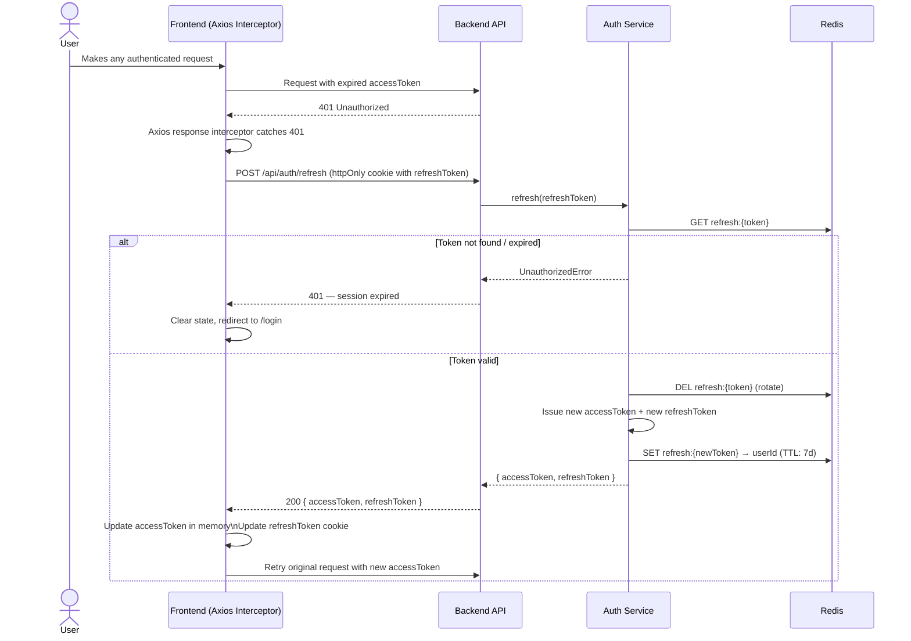

### 6.3 RBAC Authorization Model

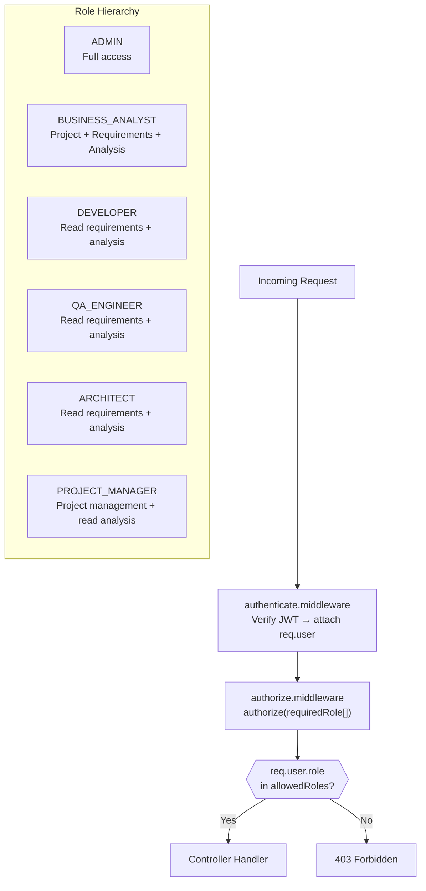

---

## 7. API Flow

### 7.1 REST API Endpoints

```
BASE URL: /api/v1

──────────────────────────────────────────
AUTH
──────────────────────────────────────────
POST   /auth/register              Register new user
POST   /auth/login                 Login → JWT
POST   /auth/refresh               Refresh access token
POST   /auth/logout                Invalidate refresh token
POST   /auth/forgot-password       Request password reset email
POST   /auth/reset-password        Reset password with token

──────────────────────────────────────────
PROJECTS
──────────────────────────────────────────
GET    /projects                   List all projects (user's)
POST   /projects                   Create project
GET    /projects/:id               Get project by ID
PUT    /projects/:id               Update project
DELETE /projects/:id               Archive project (soft delete)
GET    /projects/:id/members       List project members
POST   /projects/:id/members       Add member to project
DELETE /projects/:id/members/:uid  Remove member from project
GET    /projects/:id/dashboard     Project dashboard metrics

──────────────────────────────────────────
REQUIREMENTS
──────────────────────────────────────────
GET    /projects/:id/requirements          List requirements
POST   /projects/:id/requirements          Create requirement
GET    /projects/:id/requirements/:reqId   Get requirement
PUT    /projects/:id/requirements/:reqId   Update requirement
DELETE /projects/:id/requirements/:reqId   Delete requirement
GET    /projects/:id/requirements/:reqId/versions  Version history
POST   /projects/:id/requirements/upload   Upload file

──────────────────────────────────────────
ANALYSIS
──────────────────────────────────────────
POST   /analysis/:requirementId    Trigger AI analysis
GET    /analysis/:requirementId    Get latest analysis
GET    /analysis/:requirementId/history  Analysis history
GET    /analysis/:analysisId/status Job status (polling)

──────────────────────────────────────────
ARTIFACTS
──────────────────────────────────────────
GET    /artifacts/:analysisId            Get all artifacts
GET    /artifacts/:analysisId/:type      Get artifact by type
PUT    /artifacts/:artifactId            Edit artifact content
GET    /artifacts/:analysisId/export/pdf  Export PDF
GET    /artifacts/:analysisId/export/md   Export Markdown
GET    /artifacts/:analysisId/export/json Export JSON

──────────────────────────────────────────
NOTIFICATIONS
──────────────────────────────────────────
GET    /notifications              Get user notifications
PUT    /notifications/:id/read     Mark as read
PUT    /notifications/read-all     Mark all as read

──────────────────────────────────────────
ADMIN
──────────────────────────────────────────
GET    /admin/users                List all users
PUT    /admin/users/:id/role       Update user role
DELETE /admin/users/:id            Deactivate user
GET    /admin/audit-logs           View audit logs
```

### 7.2 Standard API Response Envelope

```
Success Response:
{
  "success": true,
  "data": { ... },
  "meta": {
    "page": 1,
    "limit": 20,
    "total": 100,
    "totalPages": 5
  }
}

Error Response:
{
  "success": false,
  "error": {
    "code": "VALIDATION_ERROR",
    "message": "Human-readable error message",
    "details": [ ... ]   // field-level validation errors
  }
}
```

---

## 8. Sequence Diagrams

### 8.1 Create & Analyze Requirement (Full Flow)

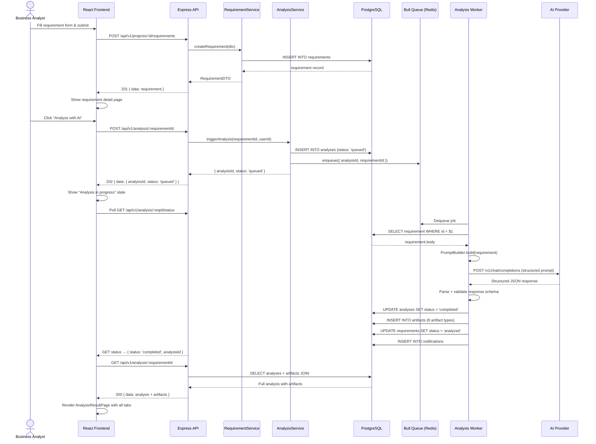

---

### 8.2 Export Artifacts as PDF

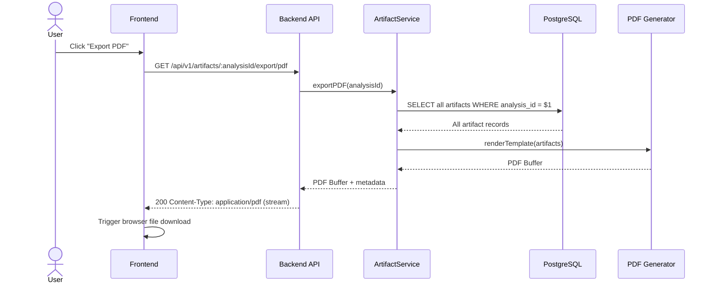

---

### 8.3 User Registration

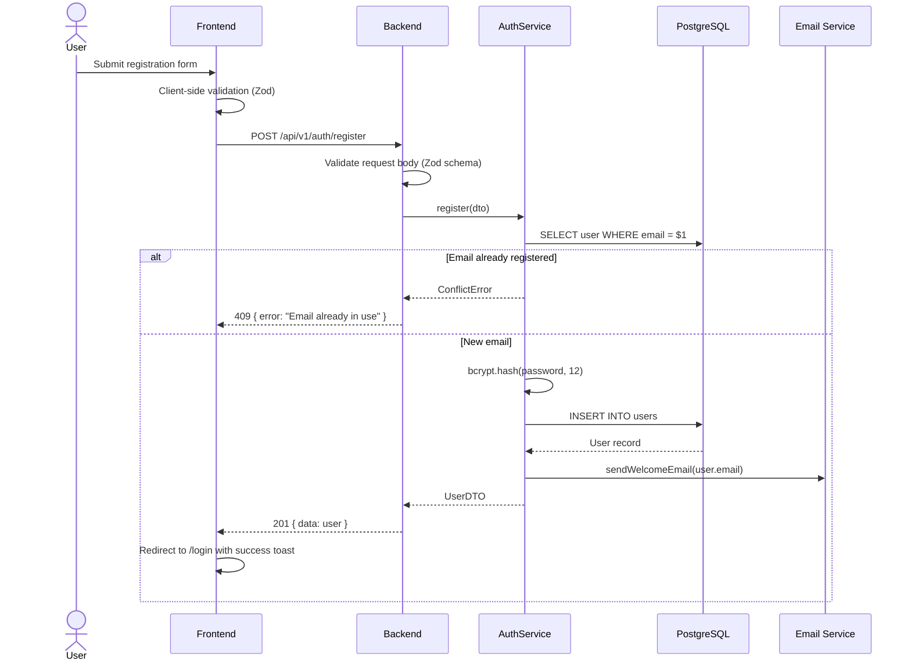

---

## 9. Deployment Diagram

### 9.1 Docker Compose — Local Development

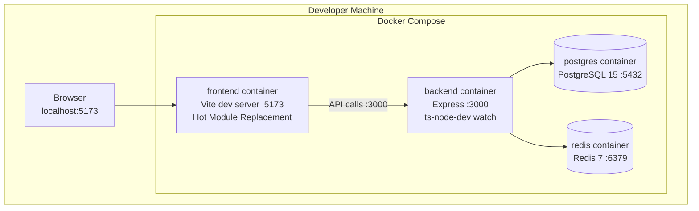

### 9.2 Production Deployment Architecture

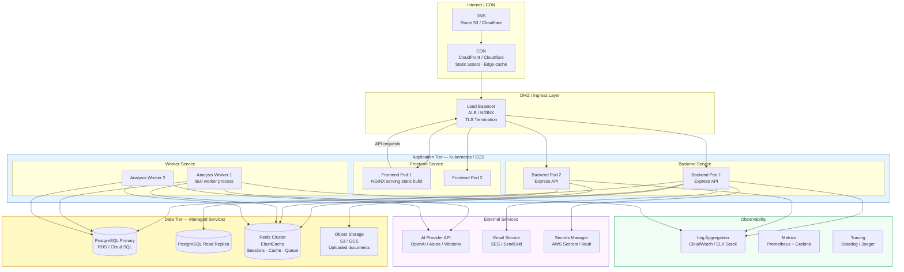

---

## 10. Technology Selection

### 10.1 Frontend Stack

| Technology | Version | Justification |
|---|---|---|
| **React** | 19 | Industry-standard; concurrent rendering, Server Components ready |
| **TypeScript** | 5.x | Type safety, enterprise-grade maintainability |
| **Vite** | 5.x | Blazing fast dev server; ESM-native bundling |
| **Material UI (MUI)** | 6.x | Enterprise design system; accessibility built-in; theme system |
| **Redux Toolkit** | 2.x | Predictable state; DevTools; minimal boilerplate vs vanilla Redux |
| **React Router** | 6.x | Nested routing; data router; route-level code splitting |
| **Axios** | 1.x | Interceptor support; request/response transformation; cancellation |
| **React Hook Form** | 7.x | Performant forms; Zod resolver integration |
| **Zod** | 3.x | Schema validation; shared with backend |
| **date-fns** | 3.x | Lightweight date utilities |

### 10.2 Backend Stack

| Technology | Version | Justification |
|---|---|---|
| **Node.js** | 20 LTS | Event-loop model suits I/O-bound AI API calls; large ecosystem |
| **Express** | 4.x | Minimal, flexible; well-understood in enterprise teams |
| **TypeScript** | 5.x | Type safety across the full stack |
| **pg (node-postgres)** | 8.x | Native PostgreSQL driver; fine-grained SQL control; pooling |
| **Bull** | 4.x | Redis-backed job queue; retries, backoff, concurrency control |
| **bcrypt** | 5.x | Industry-standard password hashing |
| **jsonwebtoken** | 9.x | JWT sign/verify; asymmetric key support |
| **Zod** | 3.x | Request validation; shared schemas with frontend |
| **Winston** | 3.x | Structured JSON logging; multiple transports |
| **express-rate-limit** | 7.x | DDoS and abuse protection |

### 10.3 Database & Caching

| Technology | Version | Justification |
|---|---|---|
| **PostgreSQL** | 15 | ACID compliance; JSONB for artifact content; full-text search |
| **Redis** | 7 | Job queue (Bull), refresh token store, rate limit counters, cache |

### 10.4 AI Integration Strategy

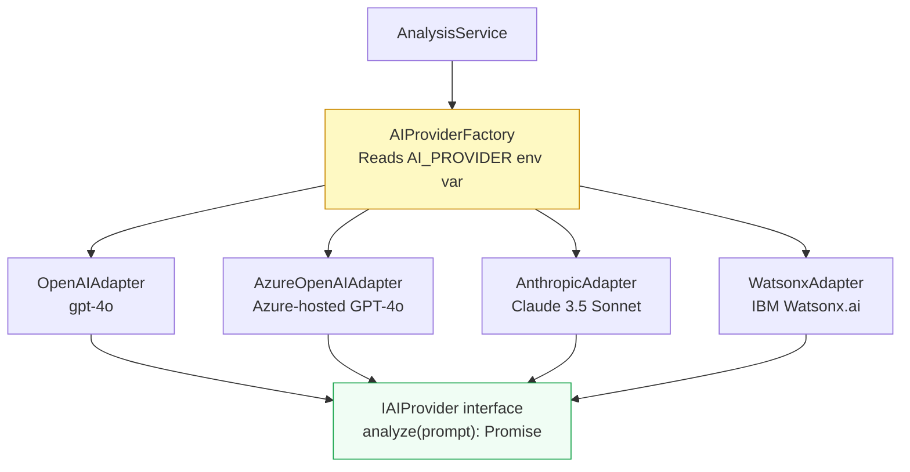

**AI Provider Interface Contract:**
```typescript
interface IAIProvider {
  analyze(prompt: string, options: AIAnalysisOptions): Promise<AIAnalysisResult>;
  getModelInfo(): AIModelInfo;
}
```

### 10.5 Security Architecture

```mermaid
graph LR
    subgraph Perimeter["Perimeter Security"]
        TLS["TLS 1.2+ Termination"]
        RATE["Rate Limiting\n100 req/min per IP"]
        CORS["CORS Policy\nWhitelist origins"]
    end

    subgraph AppSecurity["Application Security"]
        JWT["JWT Authentication\nHS256 / RS256\n15min expiry"]
        RBAC["RBAC Authorization\nRole-based endpoint guards"]
        VALID["Input Validation\nZod schemas — all inputs"]
        SANITIZE["Input Sanitization\nStrip XSS before AI calls"]
        AUDIT["Audit Logging\nAll mutations logged"]
    end

    subgraph DataSecurity["Data Security"]
        BCRYPT["Password Hashing\nbcrypt rounds=12"]
        SECRETS["Secrets Manager\nNo env vars in code"]
        BACKUP["DB Backups\nDaily automated"]
    end

    Perimeter --> AppSecurity --> DataSecurity
```

### 10.6 Observability Stack

| Concern | Tool | Detail |
|---------|------|--------|
| **Structured Logging** | Winston | JSON format; levels: error, warn, info, debug; request IDs |
| **Error Tracking** | Sentry | Real-time error capture; stack traces; release tracking |
| **Metrics** | Prometheus + Grafana | API latency, queue depth, analysis success rate |
| **Distributed Tracing** | OpenTelemetry | Trace request → service → DB → AI provider |
| **Health Checks** | `/api/health` endpoint | DB ping, Redis ping, version info |

### 10.7 Development Toolchain

| Tool | Purpose |
|------|---------|
| **ESLint** | Code quality — custom enterprise ruleset |
| **Prettier** | Code formatting — enforced in CI |
| **Husky + lint-staged** | Pre-commit hooks — lint + format on staged files |
| **Vitest** | Frontend unit testing |
| **Jest** | Backend unit + integration testing |
| **Docker + Docker Compose** | Local development environment |
| **GitHub Actions** | CI/CD pipeline — lint → test → build → deploy |

---

## Appendix A: Architecture Decision Records (ADRs)

| ADR | Decision | Rationale |
|-----|----------|-----------|
| ADR-001 | PostgreSQL JSONB for artifact content | Flexible schema for 8+ artifact types; queryable; ACID guarantees |
| ADR-002 | Bull + Redis for async AI jobs | AI calls are slow; async processing prevents API timeouts |
| ADR-003 | JWT access token in memory, refresh in httpOnly cookie | Prevents XSS theft of access tokens; CSRF mitigated via SameSite |
| ADR-004 | AI provider as Strategy pattern | Swap providers without changing application code; testable |
| ADR-005 | Monorepo with shared types package | Single source of truth for DTOs; prevents frontend/backend drift |
| ADR-006 | Clean Architecture layers | Testable domain logic; infrastructure swappable; framework-independent core |
| ADR-007 | Express over NestJS | Simpler mental model; less magic; easier to onboard enterprise teams |
| ADR-008 | Raw SQL (pg) over ORM | Full control over queries; no N+1 surprises; migrations as plain SQL |

---

*Document End — ReqAI HLD v1.0.0*
